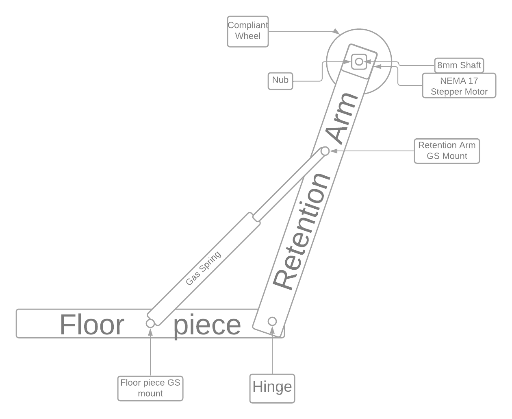

# Notopilot
Definitely NOT a single axis altitude hold PID controlled autopilot. 

# The Scope
The scope of this project is to design, build, test, and implement a single axis, altitude preselect, autopilot for small general aviation aircraft. The budget for the project is $100 and whatever crap is sitting around my hangar. 

# The Systems
The MK1 autopilot control system consists of a 3 position momentary rocker switch, an arduino uno, a DC stepper motor driver breakout board, a battery system, and a NEMA 17 stepper motor.

# The Gameplan
The current plan for the MK1 Notopilot is to simply design, build, test, tune, and implement a simple electric trim system. The autopilot consists of a floor piece, a retention arm, a hinge, a gas spring, a NEMA 17 stepper motor, a "Nub" from AndyMark, and a 4" 35A 8mm bore compliant wheel from AndyMark. The floor piece is velcroed or zip tied to the aircrafts floor, just aft of the pedestal. At the end of the floor piece, a hinge is connected to the bottom of the retention arm, so that the angle between the floor piece is just greater than 90°, with the retention arm being the piece of the assembly closest to the pedestal. There is a gas spring, to force a positive angle between the floor piece and the retention arm, with one mounting point of the gas spring on the retention arm, the other on the floor piece. At the top of the retention arm, a NEMA 17 stepper motor is mounted with the shaft perpendicular to the aircraft centerline. Attached to the shaft of the motor, is a nub, which lets you drive AndyMark wheels using a shaft. Attached to the nub is the compliant wheel, which pushed against the trim wheel, with whatever force the gas spring is exerting on the retention arm.

